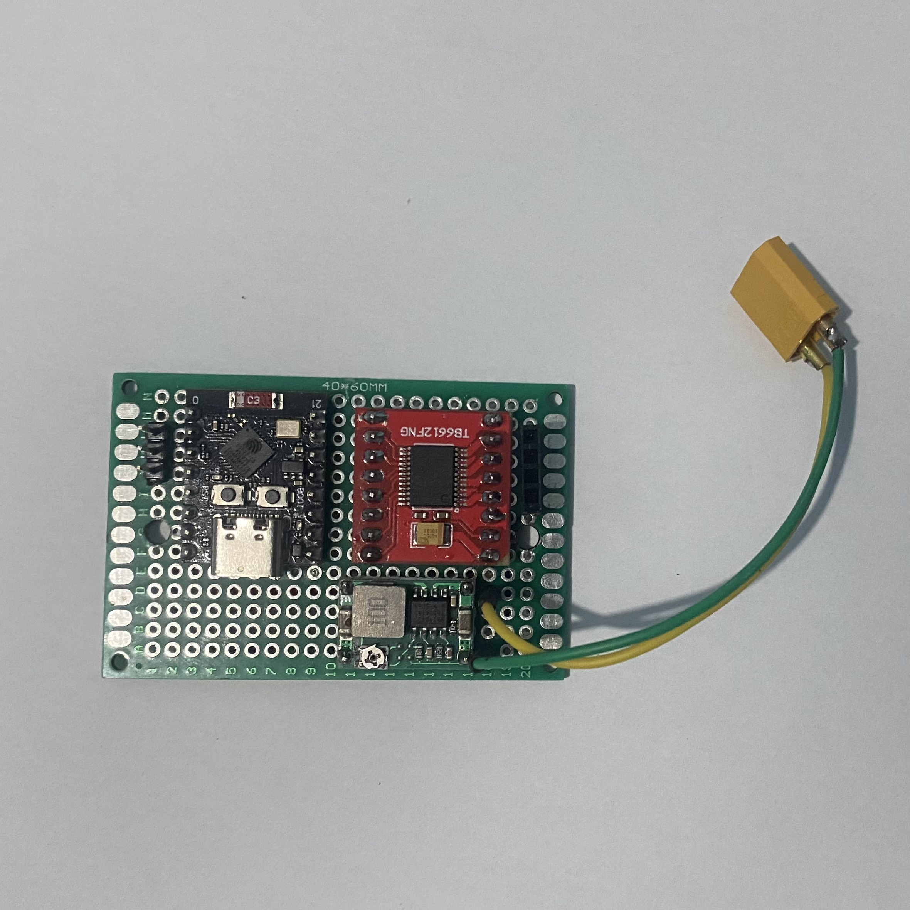

# RC CAR ASA
RC CAR ASA is a custom-engineered robotics platform designed to bridge the gap between hobbyist RC cars and professional embedded systems. Built to achieve maximum agility on a closed-circuit track, this project focuses on low-latency wireless communication and efficient power management.

Unlike standard off-the-shelf kits, this vehicle utilizes an ESP32 microcontroller to handle real-time Bluetooth HID processing, enabling precise control via an Ipega PG9090 wireless controller. The result is a highly responsive machine that successfully clocked a record lap time of 1 minute and 38 seconds, demonstrating a successful integration of hardware and software optimization.

### Performance Highlights
- Record Lap Time: 01:38.00 (Standard Track)
- Control Latency: <10ms via Bluetooth HID
- Power System: 11.1V 3S LiPo with 5V Regulated Logic
- Calculated Top Speed: ~1.1m/s
- Power-to-Weight Ratio: 2:1 (Ideal for technical tracks)
- Total Curb Weight: 500g (Optimized for agility)
- Platform: ESP32 Dual-Core (Logic & Communication Decoupling)

## Overview
This project demonstrates a full-stack embedded engineering approach to vehicle dynamics. It is built upon three core pillars: Power Efficiency, Modular Firmware, and Precision Control.

### 1. Electrical System & Power Delivery
To support the high-torque demands of the N20 (12V 500RPM) motors, the system utilizes a 3S LiPo battery (11.1V). To ensure logic stability, a 360 Buck Converter steps this voltage down to a clean 5V rail. This dual-rail architecture allows the TB6612FNG motor driver to deliver maximum voltage to the actuators without causing brownouts or resets on the ESP32 logic controller.

### 2. Control Logic & Actuation
The vehicle employs a hybrid steering system:

- Front-End: An SG90 Micro Servo provides high-precision proportional steering for sharp cornering.

- Rear-End: Dual N20 motors are controlled via high-frequency PWM (Pulse Width Modulation), allowing for granular speed adjustments.

- Wireless Interface: Using the Bluetooth HID profile, the ESP32 parses analog joystick data from the Ipega controller with sub-10ms latency.

### 3. Software Architecture
The firmware is structured into modular layers to maintain a high-speed control loop. By separating the Input Layer (Bluetooth polling) from the Logic Layer (Differential drive mixing and mapping), the system ensures that motor outputs are updated consistently, even during high-bandwidth wireless transmissions. This software design was pivotal in shaving seconds off the lap time by providing a smooth, linear throttle and steering response.

## Key Features
- Wireless remote control (Bluetooth / RF / Wi-Fi)
- DC motor control using motor driver module
- Precise steering control
- Modular embedded firmware architecture
- Battery-powered system with onboard regulation

## Technologies Used
- Microcontroller: ESP32 C3 SUPERMINI
- Motor Driver: TB6612FNG
- 360 Stepdown Buck Converter
- SG90 MicroServo
- N20 Motors 12v 500rpm
- 11.1v LiPo Battery
- ipega PG9090 Wireless Controller
- Programming Language: C
- Version Control: Git & GitHub
- Documentation: Markdown, diagrams

## Components Breakdown
- ESP32 Microcontroller: Selected for its dual-core capability and integrated Bluetooth stack, allowing simultaneous communication and motor control.
- TB6612FNG Motor Driver: Chosen over the L298N for its higher efficiency (MOSFET-based) and smaller form factor, reducing heat and weight.
- N20 Motors (12V 500RPM): High-torque micro-geared motors that provide the necessary acceleration for tight track corners.
- SG90 MicroSerco: Lightweight servo motor for precise steering angle.
- 360 Buck Converter: An ultra-compact DC-DC step-down module used to efficiently regulate the 11.1V LiPo voltage down to 5V for logic components.
- Ipega PG9090: A low-latency wireless controller that provides precise analog input for the steering servo and throttle.

## Hardware Diagram
This diagram illustrates the high-level power distribution and data flow within the vehicle. It visually separates the high-current power domain ($11.1V$ for the N20 motors) from the regulated logic domain ($5V$ for the ESP32 and SG90 Servo). This visualization explains how the 360 Buck Converter acts as the bridge to ensure the microcontroller remains stable during high-torque motor maneuvers.
  

*Figure 1: RC CAR ASA HARDWARE DIAGRAM.*

## Software Diagram
The software diagram maps the functional blocks of the firmware. It visualizes the path from input to action: starting with the Bluetooth HID data reception from the Ipega PG9090, moving through the Differential Drive Mixer logic, and ending with the PWM generation for the TB6612FNG motor driver. This provides a clear overview of how the code is structured to minimize latency and maximize steering precision.

*Figure 2: RC CAR ASA SOFTWARE DIAGRAM.*

## Wiring Diagram
This is the primary assembly blueprint. It provides a pin-to-pin mapping of every physical connection in the system. It specifically details the wiring of the ESP32 GPIOs to the TB6612FNG driver inputs, the signal line for the SG90 Servo, and the Common Ground (GND) network. This diagram is essential for troubleshooting electrical continuity and ensuring signal integrity across the chassis.

*Figure 3: RC CAR ASA WIRING DIAGRAM.*

## Project Documentation

View RC CAR ASA MAIN CIRCUIT

*Figure 4: RC CAR ASA MAIN CIRCUIT TOP VIEW.*

*Figure 5: RC CAR ASA MAIN CIRCUIT BOTTOM VIEW.*

View RC CAR ASA PHOTOS

.jpeg)
*Figure 6: RC CAR ASA ISOMETRIC VIEW.*
.jpeg)
*Figure 7: RC CAR ASA TOP VIEW.*
.jpeg)
*Figure 8: RC CAR ASA FRONT VIEW.*
.jpeg)
*Figure 9: RC CAR ASA LEFT SIDE VIEW.*
.jpeg)
*Figure 10: RC CAR ASA RIGHT SIDE VIEW.*
.jpeg)
*Figure 11: RC CAR ASA BACK SIDE VIEW.*

View RC CAR ASA PHOTOS(NO TOP COVER)

.jpeg)
*Figure 12: RC CAR ASA ISOMETRIC VIEW (WITH BATTERY).*
.jpeg)
*Figure 13: RC CAR ASA ISOMETRIC VIEW (NO TOP COVER).*
.jpeg)
*Figure 14: RC CAR ASA TOP VIEW (NO TOP COVER).*
.jpeg)
*Figure 15: RC CAR ASA FRONT VIEW (NO TOP COVER).*
.jpeg)
*Figure 16: RC CAR ASA LEFT SIDE VIEW (NO TOP COVER).*
.jpeg)
*Figure 17: RC CAR ASA RIGHT SIDE VIEW (NO TOP COVER).*
.jpeg)
*Figure 18: RC CAR ASA BACK SIDE VIEW (NO TOP COVER).*

View RC CAR ASA CONTROLLER

*Figure 19: RC CAR ASA IPEGA 9090 CONTROLLER.*

### Performance Demonstration
View the Sample Videos of RC CAR ASA here:
[**Click here to watch the Sample Videos on Google Drive**](https://drive.google.com/drive/folders/1S8k-swSK48Z8l2u1Qwt3Y57Wt0VImPYA?usp=drive_link)

